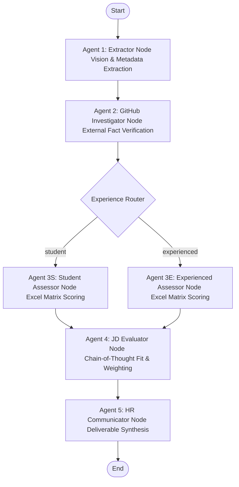

# AI Resume Evaluator (Version 2) - Multi-Agent Architecture

## Overview
This repository contains the V2 architecture for an Applicant Tracking System (ATS) Candidate Evaluator. Moving away from the deterministic NLP heuristics of V1, this system leverages a **Multi-Agent LLM architecture** orchestrated by LangGraph to semantically read, verify, and score candidate profiles against dynamic Job Descriptions.

The system incorporates:
* **Multimodal Vision Parsing**: Resumes are read using Gemini's native visual processing of PDF snapshots, completely avoiding PDF-to-text layout parsing issues.
* **Custom Docx Extraction**: Native python parsing of Microsoft Word Job Descriptions.
* **External Verification**: Querying the live GitHub API for candidate project verification and activity history.
* **Dual-Tier RAG Scoring**: Scoring the candidate against structured matrix rules loaded from Excel (`Profile Completion&Strength.xlsx`) and calculating fit against Job Descriptions using Chain-of-Thought reasoning.
* **Automated Deliverables**: Generation of personalized candidate outreach emails, hiring manager summaries, and customized technical interview questions.

---

## Architecture Diagram & Flow

The system operates using a state machine where a single `ATS_State` dictionary is passed through five specialized AI nodes:



### The Multi-Agent Pipeline (The Committee)

1. **Agent 1: The Gatekeeper / Extractor (Vision & Extraction)**
   * **Location**: [backend/extractor.py](file:///e:/AI-Resume-Evaluator-V2/backend/extractor.py)
   * **Role**: Reads the raw resume image to bypass formatting/column bugs, extracting metadata (name, GitHub username, category: student/experienced).

2. **Agent 2: The Investigator (External Verification)**
   * **Location**: [backend/tools.py](file:///e:/AI-Resume-Evaluator-V2/backend/tools.py)
   * **Role**: Fact-checks and retrieves live statistics using LangChain Tool Calling.
   * **Task**: Hits the public GitHub API to verify repos, languages, stars, and activity metrics.

3. **Agent 3S/3E: The Technical Assessor (Semantic Matrix Scoring)**
   * **Location**: [backend/assessor.py](file:///e:/AI-Resume-Evaluator-V2/backend/assessor.py)
   * **Role**: Computes matrix scoring based on experience classification.
   * **Task**: Reads rules directly from `Profile Completion&Strength.xlsx` (sheets `Student_CareerScapeScore` or `Expereinced Candidate`) via pandas, evaluating components (GPA, certifications, internships, projects, etc.). The final matrix score is programmatically calculated in Python to prevent LLM math errors.

4. **Agent 4: The Judge (Job Description Evaluator)**
   * **Location**: [backend/main.py](file:///e:/AI-Resume-Evaluator-V2/backend/main.py)
   * **Role**: Cross-references the candidate's resume & GitHub data against the Job Description.
   * **Task**: Utilizes **Chain-of-Thought (CoT)** reasoning (ordered first in Pydantic schema) to compare candidate details against JD requirements before determining a JD fit score.

5. **Agent 5: The HR Communicator (Final Deliverables)**
   * **Location**: [backend/main.py](file:///e:/AI-Resume-Evaluator-V2/backend/main.py)
   * **Role**: Synthesizes output assets.
   * **Task**: Drafts a personalized candidate email (encouraging next steps if approved, polite rejection if not), a concise technical brief for hiring managers, and 3 tailored technical interview questions based on candidate projects and the JD.

---

## Dual-Scoring Mechanism

The pipeline applies a two-tier weighted system to calculate the candidate's ultimate viability:
$$\text{Final Weighted Score} = (0.3 \times \text{Excel Matrix Score}) + (0.7 \times \text{JD Fit Score})$$

* **Threshold**: Candidates scoring $\ge 60.0$ are marked as **approved**; others are marked as **rejected**.

---

## Output Schema (`output.json`)

All execution results are saved to [output.json](file:///e:/AI-Resume-Evaluator-V2/output.json) conforming to the following keys:
* `raw_resume`: Transcribed text of the resume.
* `jd_text`: Raw text of the Job Description.
* `name`: Candidate's name.
* `github_username`: Extracted GitHub username.
* `category`: `"student"` or `"experienced"`.
* `github_data`: Structured GitHub profile metrics & repositories list.
* `score`: Excel matrix base score out of 100.
* `reasoning`: Explanatory text containing structured matrix lookups and calculations.
* `jd_score`: JD Fit score out of 100.
* `jd_reasoning`: Detailed requirement-by-requirement comparison and fit reasoning.
* `final_weighted_score`: Final combined rating.
* `final_decision`: `"approved"` or `"rejected"`.
* `candidate_email`: Draft email context.
* `hiring_manager_brief`: Brief bullet points/paragraphs for the hiring manager.
* `interview_questions`: Array of 3 candidate-specific interview questions.

---

## Setup & Installation

### 1. Prerequisites
Ensure Python 3.10+ is installed on your machine.

### 2. Clone and Setup Virtual Environment
```bash
# Clone the repository (or navigate to it)
cd AI-Resume-Evaluator-V2

# Create a virtual environment
python -m venv .venv

# Activate the virtual environment
# On Windows:
.venv\Scripts\activate
# On macOS/Linux:
source .venv/bin/activate
```

### 3. Install Dependencies
```bash
pip install -r requirements.txt
```

### 4. Set Environment Variables
Create a `.env` file in the `backend` directory:
```env
MONGODB_URL="your-mongodb-connection-string"
GITHUB_TOKEN="your-optional-github-token"
```

> [!NOTE]
> * `GOOGLE_APPLICATION_CREDENTIALS` is dynamically referenced inside `server.py` to point to the authorized service account JSON key file (`backend/ai-resume-evaluator-498012-305d5547940c.json`).
> * `GITHUB_TOKEN` is optional but highly recommended to prevent GitHub API rate-limiting during candidate verification.

---

## Running the Pipeline

The system is split into a Python FastAPI backend and a React TypeScript frontend.

### 1. Running the Backend Server
Navigate to the `backend` directory:
```bash
cd backend
# Activate the virtual environment
.venv\Scripts\activate
# Start the FastAPI server
python server.py
```
The backend server will run on `http://127.0.0.1:8000`.

### 2. Running the Frontend Dashboard
Navigate to the `frontend` directory:
```bash
cd frontend
# Start the Vite development server
npm run dev
```
Open `http://localhost:5173` in your browser to access the dashboard.